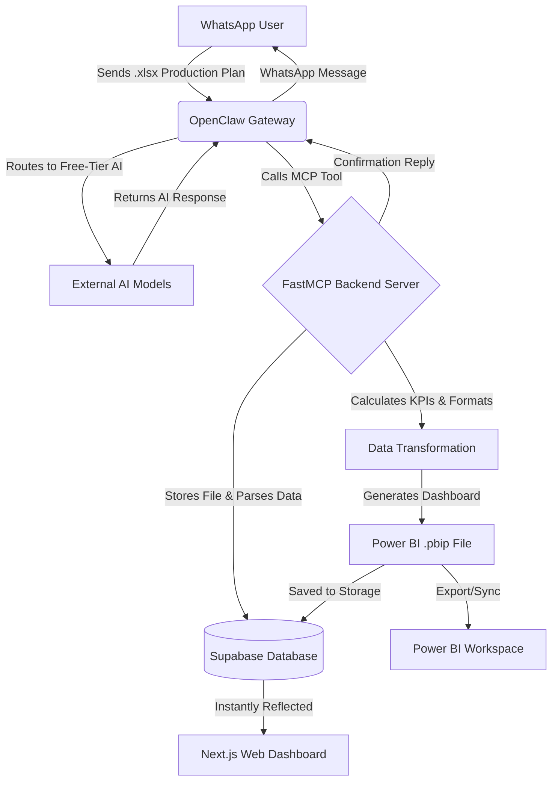

# Lumina | Lifewood Overview

## What the Project Does
Lumina | Lifewood is an end-to-end AI agent integrated with WhatsApp via OpenClaw, designed to automate production plan data visualization. The system seamlessly ingests Excel-based production plans from users via WhatsApp, processes the data through an automated ETL pipeline, and generates live Power BI datasets (.pbip). It features an immersive, glassmorphism-inspired web dashboard for instant visualization and tracking of key performance indicators (KPIs) such as Target vs. Actual quantities, hours, and completion rates.

## Tech Stack
### Frontend (Web Dashboard)
- **Next.js & React**: Core framework and UI library.
- **TypeScript**: For type-safe frontend development.
- **GSAP**: For fluid micro-animations and a premium glassmorphism UI.
- **Recharts**: For live data visualizations and dynamic chart previews.
- **Vanilla CSS**: For custom styling and aesthetic control.

### Backend (Data & AI Integration)
- **Python**: Core language for backend logic and ETL pipelines.
- **FastMCP**: To expose Model Context Protocol (MCP) tools for the AI agent.

### Storage & Database
- **Supabase**: PostgreSQL database management (users, conversations) and file hosting for generated datasets.

### Integrations
- **OpenClaw**: Handles the WhatsApp channel gateway and AI conversational interface. Rather than running a local AI model, it routes requests by shuffling between various free-tier external AI models to process conversations efficiently without local overhead.
- **Power BI REST API**: Used to sync the generated PBIP datasets for live organization-wide reporting.

## Pipeline Workflow

